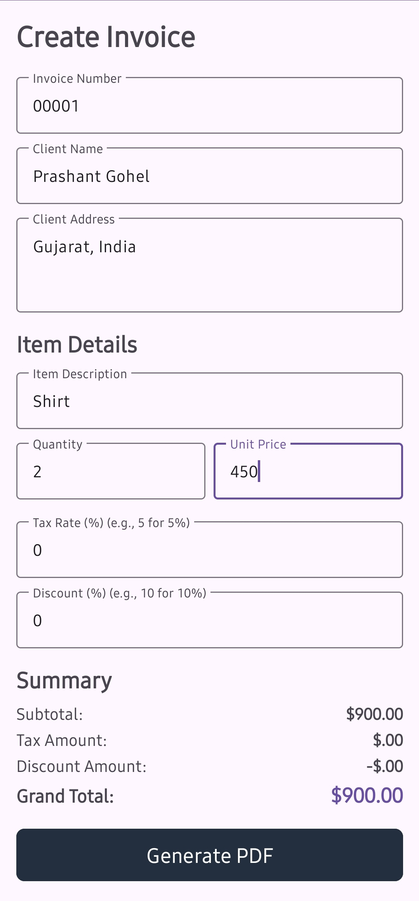
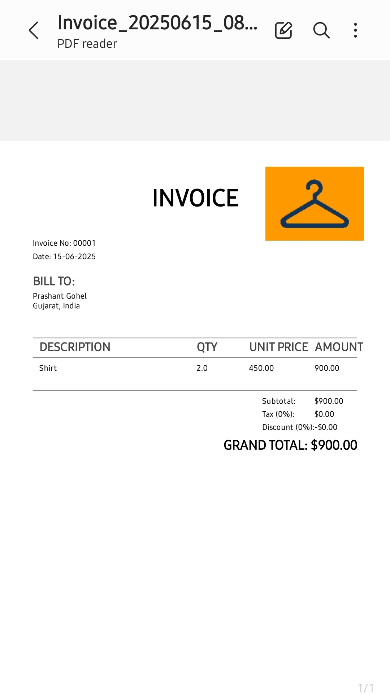

# Android Invoice Generator

A simple Android application built with Java that allows users to input invoice details and dynamically generate a PDF invoice, including a custom company logo.

## 🌟 Features

* **User-Friendly Input:** Intuitive interface for entering invoice number, client details, item description, quantity, unit price, tax rate, and discount.
* **Real-time Calculations:** Automatically calculates subtotal, tax amount, discount amount, and grand total as the user types.
* **PDF Generation:** Generates a professional-looking PDF invoice directly on the device using Android's built-in `PdfDocument` API.
* **Custom Logo Support:** Easily integrate your company's logo into the generated PDF.
* **PDF Viewing:** Automatically opens the generated PDF with the device's default PDF viewer application.
* **File Storage:** Saves the generated PDF to the app-specific external storage (`Android/data/your.package.name/files/Documents/`).

## 🛠️ Technologies Used

* **Platform:** Android
* **Language:** Java
* **UI Framework:** Android SDK, Material Design Components
* **PDF Generation:** Android's `PdfDocument` API (`android.graphics.pdf`)
* **File Handling:** `java.io.File`, `FileOutputStream`, `androidx.core.content.FileProvider`

## 📸 Screenshots

*(Replace these placeholders with actual screenshots of your app running on an Android device/emulator)*

| Main Screen (Input)       | Generated PDF (Example)   |
| :------------------------ | :------------------------ |
|  |  |

## 🚀 Setup and Installation

1.  **Open in Android Studio:**
    * Launch Android Studio.
    * Click on `File` > `Open` and select the cloned project directory.
    * Let Gradle sync the project dependencies.
2.  **Add Your Company Logo:**
    * Place your company logo image file (e.g., `my_company_logo.png`) into the `app/src/main/res/drawable/` folder.
    * **Important:** Ensure the filename in `MainActivity.java` (`R.drawable.my_company_logo`) matches your actual logo's filename. If your logo file is named differently (e.g., `company_logo.png`), you must update the line in `MainActivity.java`:
        ```java
        logoBitmap = BitmapFactory.decodeResource(getResources(), R.drawable.my_company_logo);
        // Change to:
        // logoBitmap = BitmapFactory.decodeResource(getResources(), R.drawable.company_logo);
        ```
3.  **Run the Application:**
    * Connect an Android device to your computer or start an Android Emulator.
    * Click the `Run` button (green play icon) in Android Studio.

## 📋 Usage

1.  **Enter Invoice Details:** Fill in the `Invoice Number`, `Client Name`, `Client Address`, `Item Description`, `Quantity`, `Unit Price`, `Tax Rate`, and `Discount`.
2.  **Real-time Updates:** Observe the `Subtotal`, `Tax Amount`, `Discount Amount`, and `Grand Total` update as you enter quantities, prices, tax, and discount.
3.  **Generate PDF:** Click the "Generate PDF" button at the bottom of the screen.
4.  **View PDF:** If successful, a toast message will confirm PDF generation, and the app will attempt to open the PDF using your device's default PDF viewer.

## 🔒 Permissions

This application requires the following permissions for specific functionalities:

* `<uses-permission android:name="android.permission.WRITE_EXTERNAL_STORAGE" />`:
    * **Purpose:** Required for Android 10 (API 29) and below to write files to external storage, such as the generated PDF.
    * **Note for Android 11+ (API 30+):** While listed, this permission is often not explicitly required for writing to app-specific directories (`getExternalFilesDir()`) due to Scoped Storage. However, it's included for broader compatibility.
* `<uses-permission android:name="android.permission.READ_EXTERNAL_STORAGE" />`:
    * **Purpose:** Complementary to `WRITE_EXTERNAL_STORAGE`, used for reading files from external storage.
    * **Note:** Primarily relevant for older Android versions when dealing with shared storage.

Runtime permission requests are handled by the app.

## 🤝 Contributing

Contributions are welcome! If you have suggestions for improvements, new features, or bug fixes, please feel free to:

1.  Fork the repository.
2.  Create a new branch (`git checkout -b feature/your-feature-name`).
3.  Make your changes.
4.  Commit your changes (`git commit -m 'Add new feature'`).
5.  Push to the branch (`git push origin feature/your-feature-name`).
6.  Create a Pull Request.

